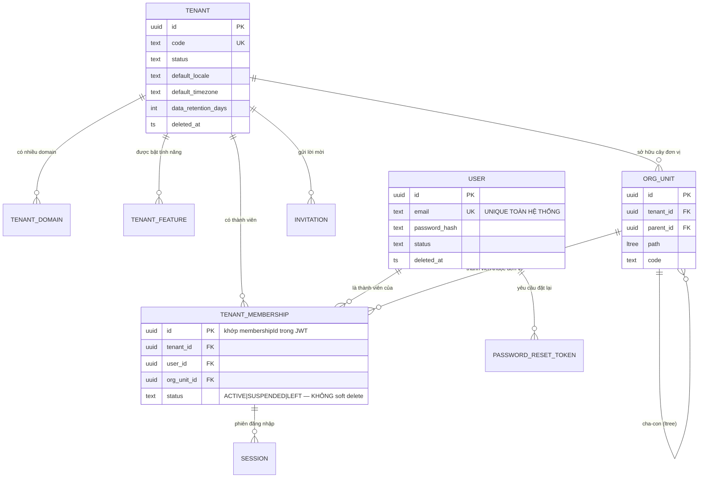
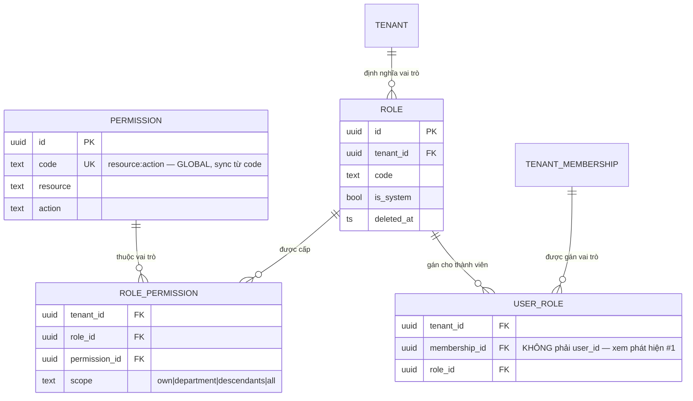
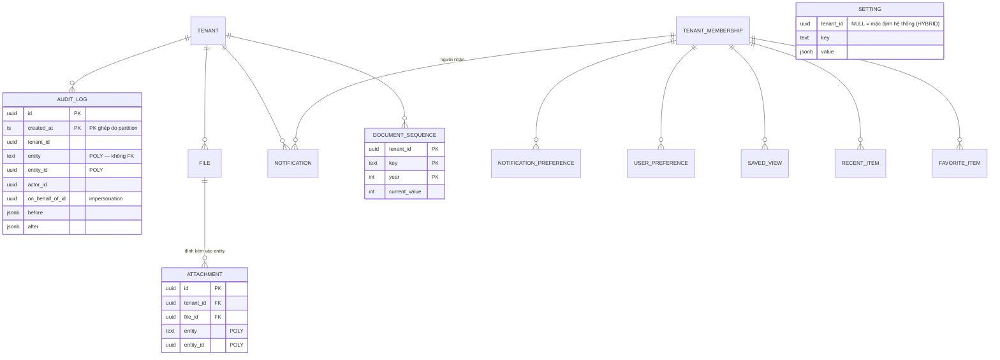
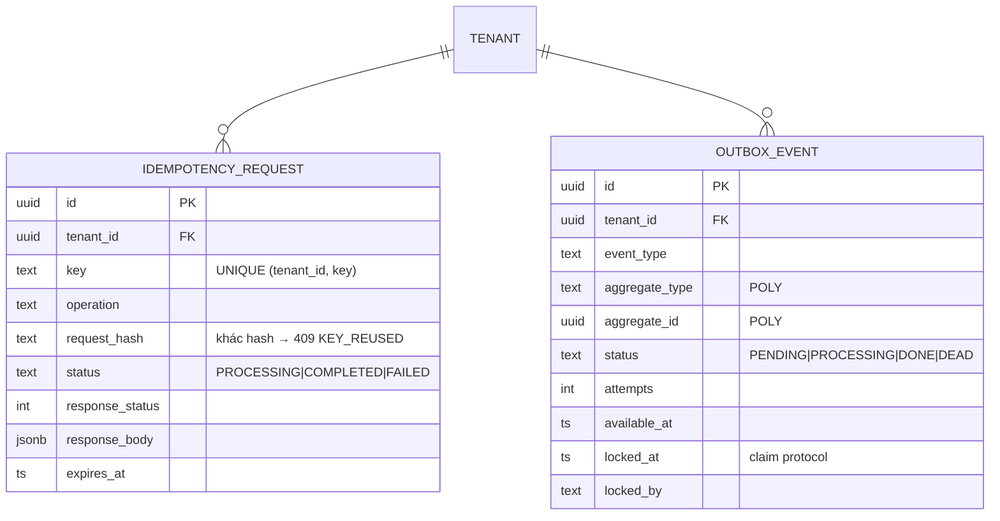
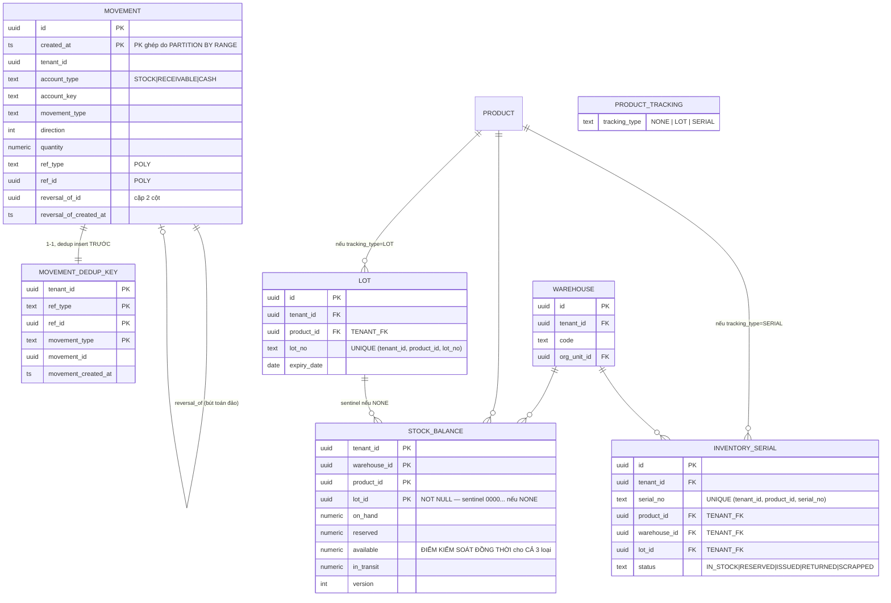
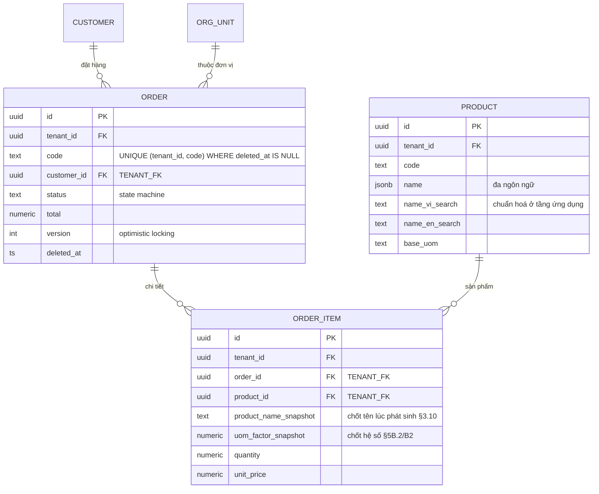
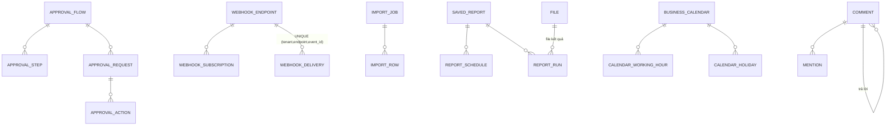

# SƠ ĐỒ QUAN HỆ DỮ LIỆU (ERD)

> Bổ trợ cho `boilerplate-spec.md` §6. Tài liệu này chỉ mô tả **quan hệ**; định nghĩa cột đầy đủ nằm ở §6.1, phân loại tenancy ở §6.5.
>
> **Quy ước đọc:**
> - `TENANT_FK` = quan hệ dùng **composite FK** `(tenant_id, parent_id)` theo §6.4
> - `POLY` = quan hệ đa hình `(entity, entity_id)` — **không có FK ở tầng DB**, phải kiểm tra ở service
> - Bảng in đậm là bảng `GLOBAL` (không có `tenant_id`)

---

## 1. Tenancy & Định danh — miền quan trọng nhất



**Ràng buộc then chốt:**

| Quan hệ | Ràng buộc |
|---|---|
| `TENANT_MEMBERSHIP` | `PRIMARY KEY (id)` + `UNIQUE (tenant_id, user_id)` |
| `ORG_UNIT.parent_id` | `TENANT_FK` — đơn vị cha phải cùng tenant |
| `TENANT_MEMBERSHIP.org_unit_id` | `TENANT_FK` |
| `USER.email` | `UNIQUE` toàn hệ thống — một người, một email, nhiều membership |

---

## 2. Phân quyền



**Quan trọng:** `scope` nằm ở `ROLE_PERMISSION`, không nằm ở `ROLE`. Cùng một vai trò có thể có `order:read` scope `all` nhưng `salary:read` scope `own`.

---

## 3. Hạ tầng dùng chung



**Bảng đa hình** — `audit_logs`, `attachments`, `comments`, `entity_subscriptions`, `saved_views`, `recent_items`, `favorite_items`: cột `(entity, entity_id)` **không thể có FK**. Phải có:
- Enum `EntityType` dùng chung ở `packages/shared`
- Kiểm tra tồn tại + kiểm tra quyền ở service trước khi ghi
- Job dọn bản ghi mồ côi (chạy hằng tuần)

---

## 4. Nhất quán giao dịch



---

## 5. Số dư — movement + snapshot



---

## 6. Module nghiệp vụ mẫu [REF]



`ORDER_ITEM` là **child của aggregate**, không phải `BusinessEntityBase`: không `org_unit_id`, không `version` riêng, không soft delete, xoá cứng trong transaction sửa `Order`.

---

## 7. Module tuỳ chọn — tóm tắt quan hệ



---

# PHÁT HIỆN KHI DỰNG ERD

Dựng sơ đồ đã lộ ra **năm khoảng trống** trong §6.1. Bốn cái đầu nên sửa **trước khi viết migration GĐ1**.

## #1 — `user_roles` trỏ vào `user_id`, phải trỏ vào membership · **CHẶN GĐ3**

Schema hiện tại: `user_roles(tenant_id, user_id, role_id)`.

Cấu trúc này **cho phép gán vai trò của tenant A cho một user không phải thành viên tenant A**. Không có ràng buộc DB nào chặn.

**Sửa:**

```sql
user_roles(membership_id, role_id, :TenantAuditedBase)
  UNIQUE (tenant_id, membership_id, role_id)
  FOREIGN KEY (tenant_id, membership_id)
    REFERENCES tenant_memberships (tenant_id, id)
```

Hệ quả tốt: user rời tenant (`status = LEFT`) thì vai trò đi theo membership, không sót lại. Và khớp với `membershipId` trong JWT.

Áp dụng tương tự cho `sessions`, `delegations`, `notification_preferences`, `user_preferences` — mọi bảng gắn người dùng **trong phạm vi một tenant** đều nên trỏ `membership_id`.

## #2 — `invitations.role_ids uuid[]` không có FK · **CHẶN GĐ2**

Mảng UUID không tạo được FK, nên có thể mời kèm vai trò đã bị xoá hoặc vai trò của tenant khác.

**Sửa:** tách bảng nối

```sql
invitation_roles(invitation_id, role_id, :TenantAuditedBase)
  FOREIGN KEY (tenant_id, role_id) REFERENCES roles (tenant_id, id)
```

## #3 — `stock_balances` tham chiếu bảng chưa tồn tại · **ĐÃ GIẢI QUYẾT**

`warehouses`, `lots`, `inventory_serials` đã được bổ sung vào §6.1.

**Kèm theo một vấn đề DDL phát sinh khi chốt `tracking_type`:** với `NONE` thì `lot_id` là NULL, nhưng **PostgreSQL bắt buộc mọi cột trong PRIMARY KEY đều NOT NULL** — nên PK bốn cột không tạo được.

**Đã chốt: dùng SENTINEL** `'00000000-0000-0000-0000-000000000000'` cho `lot_id` khi `tracking_type = NONE`.

| Phương án | Được | Mất |
|---|---|---|
| **Sentinel UUID** ✅ | PK tự nhiên; hot path giữ `lot_id = :lotId`, index hoàn hảo | Không đặt được FK `lot_id → lots` |
| Hai partial unique index | Giữ NULL đúng ngữ nghĩa, FK được | Hot path phải dùng `IS NOT DISTINCT FROM`, index kém |
| Lô mặc định cho mọi SP | Đồng nhất, FK được | Một dòng rác mỗi sản phẩm |

Chọn sentinel vì conditional UPDATE ở §5B.2/B4 là query quan trọng nhất hệ thống về cả tính đúng lẫn hiệu năng.

**Và một luật đi kèm:** `stock_balances` là nguồn tồn duy nhất cho **cả ba** loại tracking. `inventory_serials` là chi tiết. Nếu để serial tự quản tồn thì có hai nguồn sự thật và mất cơ chế chống xuất âm.

## #4 — `movement_dedup_keys` chưa có FK về `movements`

Có `movement_id` + `movement_created_at` nhưng chưa khai FK.

**Sửa:**

```sql
FOREIGN KEY (movement_id, movement_created_at)
  REFERENCES movements (id, created_at)
```

**Cân nhắc ngược lại:** FK sang bảng partition làm việc `DETACH` mảnh cũ phức tạp hơn. Nếu ưu tiên archive dễ thì bỏ FK này, kiểm tra ở service. **Cần một quyết định, ghi vào ADR.**

## #5 — `approval_steps.approver_ref` đa hình, không FK

Trỏ tới `role` hoặc `user` tuỳ `approver_type`. Không tránh được, nhưng phải kiểm tra ở service. Chỉ ảnh hưởng module [OPT], không chặn.

---

## Việc cần làm

| # | Việc | Trước giai đoạn |
|---|---|---|
| 1 | `user_roles` → `membership_id` + composite FK | GĐ3 |
| 2 | Tách `invitation_roles` | GĐ2 |
| 3 | Thêm `warehouses`, `lots`; chốt có quản lý lô không | GĐ5b |
| 4 | Quyết định FK `movement_dedup_keys` → ADR | GĐ5b |
| 5 | Enum `EntityType` dùng chung cho mọi quan hệ đa hình | GĐ1 |
| 6 | `delegations` → dùng `membership_id` thay `user_id` (cùng lý do #1) | GĐ10 |
| 7 | `approval_authorities`: CHECK ít nhất một trong ba cột đối tượng khác NULL | GĐ10 |
